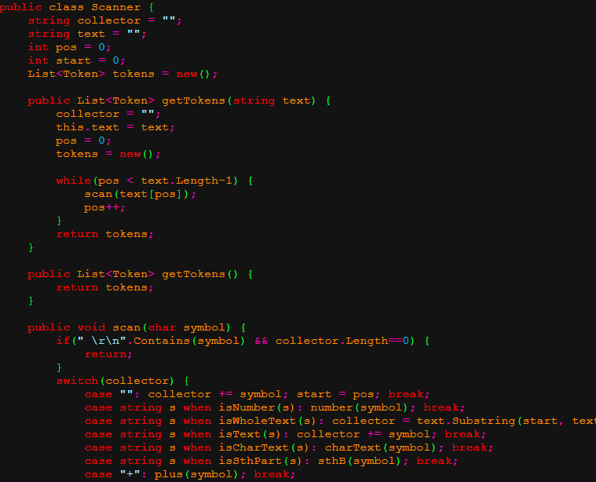

# programming languages translator
This is C# program that takes text file and puts colored version into [colored.html](colored.html) so it looks like written in code editor.

### How to run
Download this [repo](bin/Debug/net7.0) and run [skaner.exe](bin/Debug/net7.0/skaner.exe) from it. You might also need .NET.

You can specify input file by adding its path as argument, for example:
```
.\skaner.exe Scanner.cs
```
If there is no path or file does not exist, it will take default file [Scanner.cs](https://github.com/jGrzyb/programming_languages_translator/blob/main/Scanner.cs)


